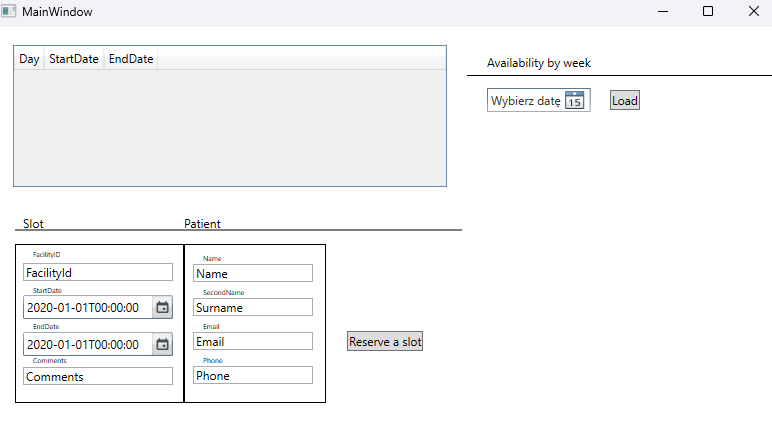

# DocPlannerEntry

This project is a backend test performed by Michał Kowalski

## Installation

Solution has been writed fully in Visual Studio Version 17.10.2, all of it's components should automatically rebuild without any further actions. Backend API has been equipped with Swagger, as well as extra WPF application to view the task and perform operations. Authorization has not been setup for this project, as it would be almost boilerplate solution, but it would require some DB setup and that has been considered as an out of scope for this task. 

In order to actually run the solution, there has to be a configuration set at following locations: 

<b>appsettings.json </b>

```
{
  "Logging": {
    "LogLevel": {
      "Default": "Information",
      "Microsoft.AspNetCore": "Warning"
    }
  },
  "AllowedHosts": "*",
  "SlotService": {
    "BaseUrl": "https://draliatest.azurewebsites.net/api/availability",
    "AvailabilityUrl": "/GetWeeklyAvailability/{0}",
    "TakeSlotUrl": "/TakeSlot"
  }
}
```

SlotService is the paragraph that is essential to running this application. Additionally, there are 2 extra parameters that need to be set, that would be (you can as well just paste the whole SlotService section into secrets, to ensure that all of the values had been loaded from same point): 

After setting up these values, one must run the DocPlannerEntry.API project, then start up the DocPlannerEntry.UI if necessary

<b>secrets.json </b> (in DocPlannerEntry.API subproject)
```
{
  "SlotService": {
    "UserName": "username",
    "Password": "password",
    "BaseUrl": "https://draliatest.azurewebsites.net/api/availability",
    "AvailabilityUrl": "/GetWeeklyAvailability/{0}",
    "TakeSlotUrl": "/TakeSlot"
  }
}
```

## Structure

DocPlannerEntry.API <i> (API folder, main starting point for running the app) </i>  

DocPlannerEntry.Shared <i> (all of the files that should be carried throughout different subprojs) </i>  

DocPlannerEntry.Tests  

DocPlannerEntry.SlotManagement.Model <i> (contains models related to SlotManagementService) </i>  

DocPlannerEntry.SlotManagement.Service <i> (contains service definition to integrate with third-party API) </i>  

DocPlannerEntry.SlotManagement.UI <i> (contains WPF project that allows to go through GUI, without looking at Swagger) </i>  


## UI

The UI is fairly straight-forward, written in WPF, despite it looks, it gets the thing done. By default, nothing is loaded and after starting up there's a message box about usage of SyncFusion nuget package (which is allowed for non-commercial use, such as this one). 



In order to load availability for the week, you could pick a date, if none is picked current day is taken as a reference point. After loading them up, there will be a screen showing data structured (Day,StartDate,EndDate). This GridView is not bind to any actions and is only for viewing (!). 

In order to take a slot, you have to manually input (no automation, wanted to create one, but as frontend is not scored as a part of this task, this has not been the case) according data. 


>No data was hard-coded, but FacilityId on this part is not received at any point by backend (this would be most likely achieved during auth process). For testing, please use the following: <br/> 
90c9f71c-685f-48e7-a6d5-7898775209ce
